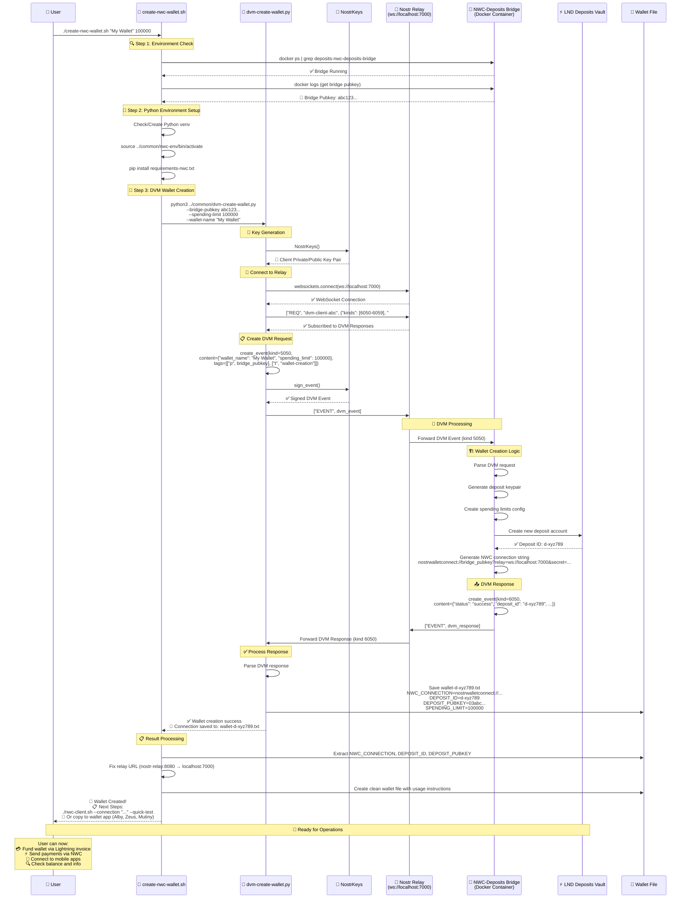

# NWC Wallet Creation via Nostr DVM - Flow Diagram

## Overview
The `./create-nwc-wallet.sh` script creates Lightning wallets using the NIP-90 DVM (Data Vending Machine) protocol combined with NWC (Nostr Wallet Connect) standards.

## Architecture Flow Diagram



## Technical Details

### 🔐 Cryptographic Components

1. **Nostr Keys (Client)**
   - **Type**: Schnorr signatures (BIP-340)
   - **Purpose**: Sign DVM requests to Nostr relay
   - **Format**: x-only public keys (32 bytes)

2. **Deposit Keys (Backend)**
   - **Type**: ECDSA signatures
   - **Purpose**: Authenticate with LND Deposits API
   - **Format**: Compressed public keys (33 bytes)

3. **Bridge Keys**
   - **Type**: Schnorr signatures
   - **Purpose**: Bridge identity and DVM responses
   - **Format**: x-only public keys (32 bytes)

### 📡 Protocol Stack

| Layer | Protocol | Purpose |
|-------|----------|---------|
| Application | Shell Script | User interface and orchestration |
| DVM Client | NIP-90 | Wallet creation requests (kinds 5050-5059) |
| NWC Operations | NIP-47 | Wallet operations (kinds 23194-23195) |
| Transport | WebSocket | Real-time communication with relay |
| Backend | LND Deposits API | Actual Lightning wallet functionality |

### 🌉 Bridge Architecture

```
┌─────────────────┐    ┌──────────────────┐    ┌─────────────────┐
│   NWC Client    │───▶│  DVM+NWC Bridge  │───▶│  LND Deposits   │
│                 │    │                  │    │      Vault      │
│ • Nostr Events  │    │ • DVM Processing │    │ • Real Lightning│
│ • NWC Requests  │    │ • Protocol Trans │    │ • Deposit Mgmt  │
│ • Wallet Apps   │    │ • Key Management │    │ • Balance Track │
└─────────────────┘    └──────────────────┘    └─────────────────┘
```

### 🎯 Key Features

- **🤖 Automated**: Single command creates complete Lightning wallet
- **🔐 Secure**: Multi-layer cryptographic authentication
- **📱 Compatible**: Works with all NWC-supporting wallet apps
- **⚡ Zero-UTXO**: No on-chain setup required
- **🌐 Decentralized**: Uses Nostr relay for communication
- **🧪 Testable**: Includes built-in testing tools

### 📁 File Outputs

The script creates multiple files for different use cases:

1. **Original DVM File**: `wallet-{timestamp}.txt`
   - Raw output from DVM protocol
   - Docker-internal relay URLs

2. **Clean Wallet File**: `wallet_dvm_{timestamp}.txt`
   - Host-accessible relay URLs
   - Usage instructions included
   - Ready for production use

3. **Connection String**: For direct wallet app integration
   ```
   nostrwalletconnect://bridge_pubkey?relay=ws://localhost:7000&secret=...
   ```

## Next Steps After Wallet Creation

1. **🧪 Quick Test**: `./nwc-client.sh --connection "..." --quick-test`
2. **📱 Mobile Apps**: Copy connection string to Alby, Zeus, or Mutiny
3. **💳 Fund Wallet**: Create invoice and receive Lightning payments
4. **⚡ Send Payments**: Pay Lightning invoices via NWC protocol
5. **🔄 Interactive Mode**: `./nwc-client.sh --connection "..." --interactive`

This architecture enables instant Lightning wallet creation with zero on-chain setup, combining the best of Nostr's decentralized communication with Lightning's payment capabilities.